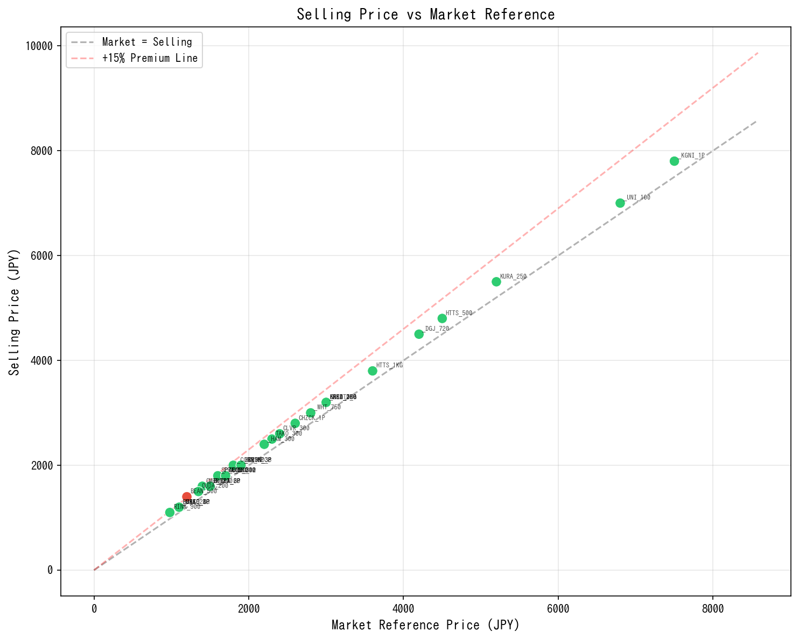
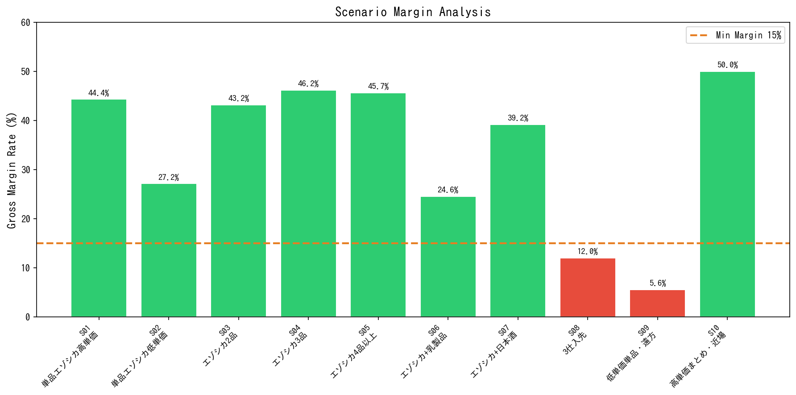
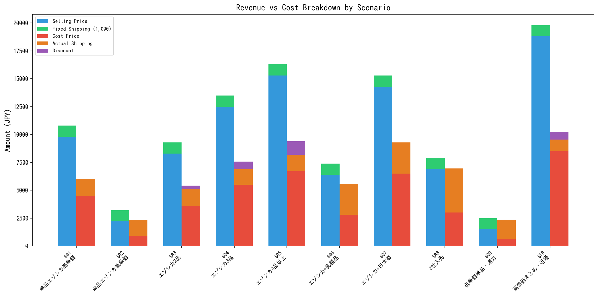
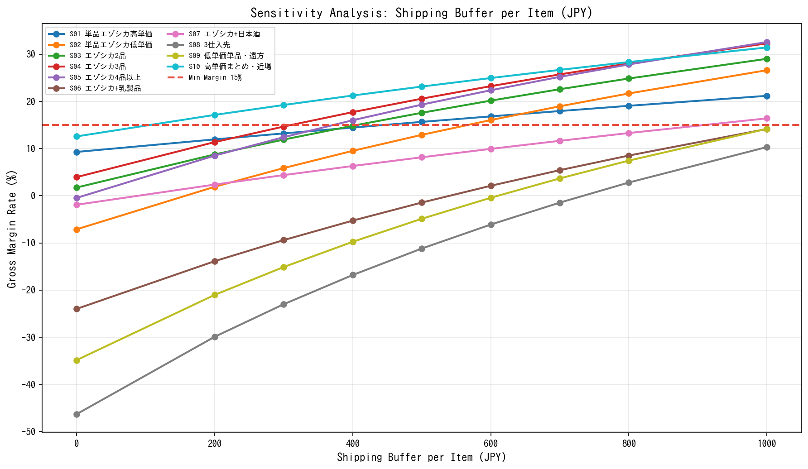
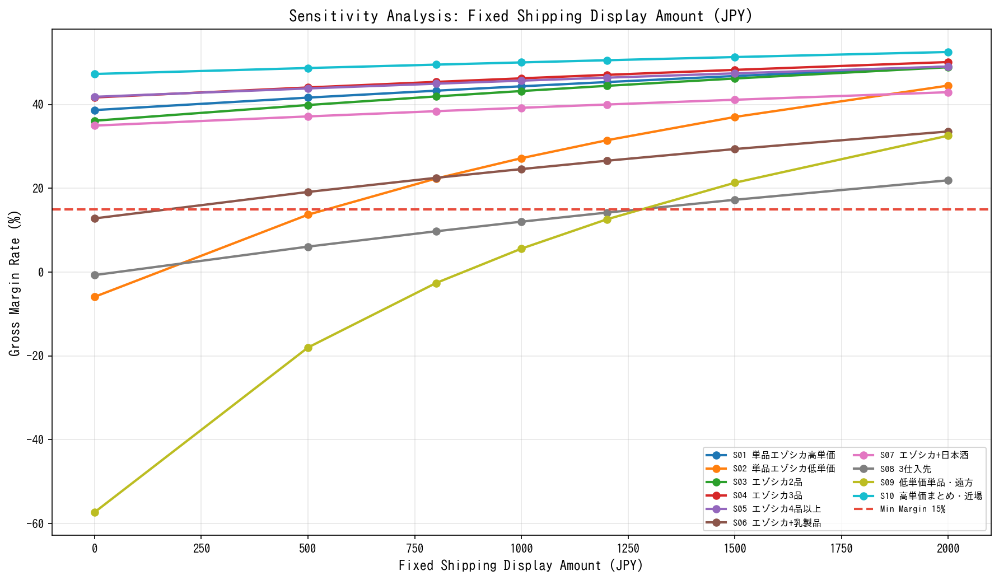
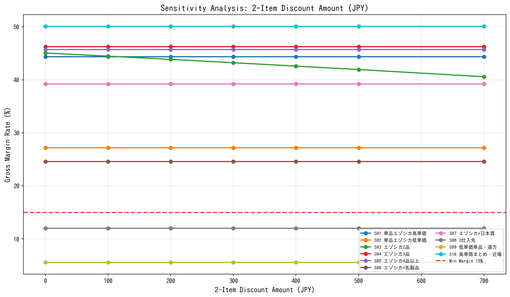

# EEZO 送料・ディスカウント シミュレーションレポート

**実行日**: 2026-02-17 02:52:14
**実験ID**: exp001_baseline

---

## 1. パラメータ設定

| パラメータ | 値 |
|-----------|-----|
| 基本マージン率 | 20% |
| 送料転嫁額/商品 | 500円 |
| 固定送料（顧客表示） | 1,000円 |
| 最低粗利率 | 15% |

### ディスカウントティア

| 条件 | 割引額 |
|------|--------|
| 同一仕入先 2品以上 | 300円 |
| 同一仕入先 3品以上 | 700円 |
| 同一仕入先 4品以上 | 1,200円 |

---

## 2. 販売価格検証

- 理論最低価格を下回る商品: **0件**
- 市場プレミアム率超過（>15%）: **1件**

---

## 3. シナリオ別シミュレーション結果

| ID | シナリオ | 地域 | 商品数 | 販売価格計 | 送料収入 | 割引 | 顧客支払 | 仕入原価 | 実配送費 | 出荷数 | 粗利 | 粗利率 | 判定 |
|-----|---------|------|--------|-----------|---------|------|---------|---------|---------|--------|------|--------|------|
| S01 | 単品エゾシカ高単価 | kansai | 1 | 9,800 | 1,000 | 0 | 10,800 | 4,500 | 1,510 | 1 | 4,790 | 44.4% | OK |
| S02 | 単品エゾシカ低単価 | kanto | 1 | 2,200 | 1,000 | 0 | 3,200 | 940 | 1,390 | 1 | 870 | 27.2% | OK |
| S03 | エゾシカ2品 | kansai | 2 | 8,300 | 1,000 | 300 | 9,000 | 3,600 | 1,510 | 1 | 3,890 | 43.2% | OK |
| S04 | エゾシカ3品 | kanto | 3 | 12,500 | 1,000 | 700 | 12,800 | 5,490 | 1,390 | 1 | 5,920 | 46.2% | OK |
| S05 | エゾシカ4品以上 | kansai | 4 | 15,300 | 1,000 | 1,200 | 15,100 | 6,690 | 1,510 | 1 | 6,900 | 45.7% | OK |
| S06 | エゾシカ+乳製品 | kanto | 2 | 6,400 | 1,000 | 0 | 7,400 | 2,800 | 2,780 | 2 | 1,820 | 24.6% | OK |
| S07 | エゾシカ+日本酒 | kansai | 2 | 14,300 | 1,000 | 0 | 15,300 | 6,500 | 2,800 | 2 | 6,000 | 39.2% | OK |
| S08 | 3仕入先 | kanto | 3 | 6,900 | 1,000 | 0 | 7,900 | 3,000 | 3,950 | 3 | 950 | 12.0% | **NG** |
| S09 | 低単価単品・遠方 | okinawa | 1 | 1,500 | 1,000 | 0 | 2,500 | 600 | 1,760 | 1 | 140 | 5.6% | **NG** |
| S10 | 高単価まとめ・近場 | hokkaido | 3 | 18,800 | 1,000 | 700 | 19,100 | 8,490 | 1,050 | 1 | 9,560 | 50.0% | OK |

**判定結果**: 8 OK / 2 NG（全10シナリオ）

---

## 4. 感度分析

### 送料転嫁額（shipping_buffer_per_item）

転嫁額を0〜1,000円で変動させた場合の各シナリオの粗利率推移。

### 固定送料表示額

固定送料を0〜2,000円で変動させた場合の各シナリオの粗利率推移。

### 2品目ディスカウント額

2品目割引を0〜700円で変動させた場合の各シナリオの粗利率推移。

---

## 5. 境界ケース分析

### 最悪ケース
- **S09 低単価単品・遠方**: 粗利率 5.6%、粗利 140円
- 要因: 低単価商品の単品購入 + 遠方配送で実配送コストが高い

### 最良ケース
- **S10 高単価まとめ・近場**: 粗利率 50.0%、粗利 9,560円
- 要因: 高単価商品のまとめ買い + 近場配送で効率が良い

---

## 6. 考察と推奨事項

### 課題
- **2シナリオが最低粗利率15%を下回っている**
- 特に低単価単品・遠方配送のケースで粗利が確保できない

### 推奨アクション
1. **低単価商品の送料転嫁額を引き上げ**（現在500円 → 検討値: 700〜800円）
2. **遠方地域への追加送料**の検討（沖縄・九州は+500〜1,000円）
3. **最低購入金額の設定**（例: 3,000円以上で送料1,000円、未満は1,500円）

---

## 7. ファイル一覧

| ファイル | 内容 |
|---------|------|
| scenario_results.csv | シナリオ別シミュレーション結果 |
| price_validation.csv | 販売価格検証結果 |
| shipment_groups.csv | 出荷グループ詳細 |
| margin_analysis.png | 粗利率棒グラフ |
| profit_breakdown.png | 収支内訳グラフ |
| price_validation.png | 販売価格 vs 市場価格散布図 |
| sensitivity_buffer.png | 感度分析: 転嫁額 |
| sensitivity_fixed_shipping.png | 感度分析: 固定送料 |
| sensitivity_discount_2.png | 感度分析: 2品目割引 |
| report.md | 本レポート |
